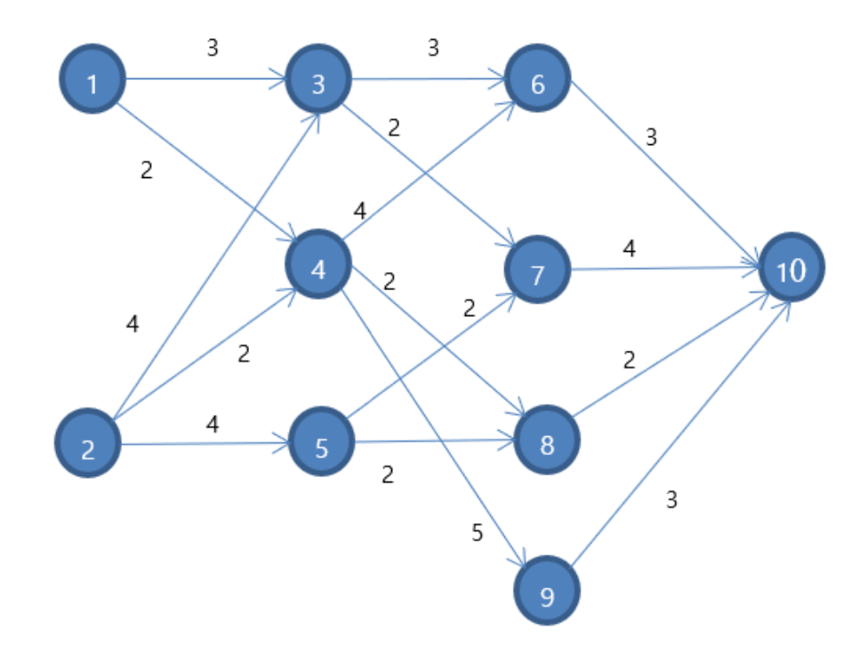

# Dynamic Programming Various Problems
  
This details the various problems that I've done that relate to dynamic programming. My solution to these problems are found in the R file provided in this folder. 
  
## Problem 1: Shortest Path Problem
In the network pictured below, find the shortest path from node 1 to node 10 and the shortest path from node 2 to node 10.  
  
  
## Problem 2: Optimizing Utility of Cake Eating  
Martin has 5 cakes and he can eat them within 3 days. Martin likes whole cake, so each day he eats an integer number of cakes or nothing. His happiness from eating i cakes on day t is 0.7(t-1)√𝑖. For example, if he eats 2 cakes on day 2, he will gain a utility of 0.71  √2.  Martin wants to maximize his total happiness, which is the sum of happiness from day 1 to day 3. How many cakes does Martin eat on the first day?  
  
## Problem 3: Formulating Optimization of Oil Drilling
At the beginning of year 1, your oil company owns 100 barrels of oil reserves. During year t (t = 1,2,..,10), the following events occur each year: (1) you extract and refine xt barrels and incur cost x2t : (2) you sell those xt barrels at a price of pt dollars per barrel; and (3) exploration for new reserves results in the discovery of bt barrels of new reserves. xt is your decision at time t. pt and bt are known and given. Also, 1 dollar at time t+1 is worth d dollars at time t.  
   
  
Clearly write down the state variables, dynamics, and dynamic programming (Bellman) Equation that you would use to solve the problems. Do not forget to include the terminal conditions (boundary conditions) that are necessary to solve the Bellman equation backward in time. 