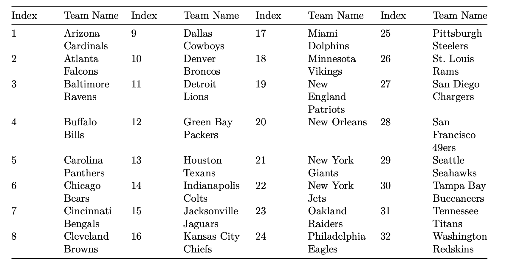

# Non Linear Programming
This details some of the nonlinear problems that I've dealt with over the course of the semester. 

## Triangle Area Optimization
The area of a triangle with sides of length a, b, and c is $\sqrt{𝑠(𝑠 − 𝑎)(𝑠 − 𝑏)(𝑠 − 𝑐)}$ (Heron's formula) where
s is half of the perimeter of the triangle. We have 60 ft of fencing and want to make a
triangular fence which contains as much area as possible. Formulate and solve an NLP
to find the optimal side lengths of the fence.

## Resource Allocation
It costs a company $12 to purchase an hour of labor and $15 to purchase an hour of capital. If L hours of labor and K units of capital are available, then 0.05L2/3K1/3 machines can be produced. Suppose the company has $100,000 to purchase labor and capital. What is the maximum number of machines it can produce? Round to the nearest whole number of machines.

## NFL 
The file nflratings.csv contains the results of 256 regular-season NFL games from the 2009 season. The teams are indexed 1 to 32 as shown below: 
  
The csv data file contains a matrix with the following columns:  
  
• Week (1-17)  
• Home Team Index (1-32 from the table above)  
  
• Visiting Team Index (1-32 from the table above)  
  
• Home Team Score  
• Visiting Team Score  
  
For example, the first game in the matrix is team 25 Pittsburgh versus team 31 Tennessee, played at Pittsburgh. Pittsburgh won the game by a score of 13 to 10, and the point spread (home team score minus visitor team score) is 3. A positive point spread means that the home team won; a negative point spread indicates that the visiting team won.  
  
The goal of this problem is to determine a set of ratings for the 32 NFL teams that most accurately predicts the actual outcomes of the games played, similar to homework 1. Here however, we will also incorporate a 'home field advantage' that adds some number of points to the predicted point spread.  Use NLP to find the ratings that best predict the actual point spreads observed. The model will estimate the home team advantage and the ratings.  The model accounts for the home team advantage by adding a constant (which you need to solve for) to the predicted point spread.  The objective is to minimize the sum of squared prediction errors. You will need to calculate the following:  
  
• Actual Point Spread = Home Team Score – Visiting Team Score  
  
• Predicted Spread = Home Team Rating – Visitor Team Rating + Home Team Advantage  
  
• Prediction error = Actual Point Spread – Predicted Point Spread  
  
Your goal is to minimize: the prediction error  
  
You will also need to normalize the ratings. To do this, you set the actual average of the ratings to be 85 (this is somewhat arbitrary but based on the well-known Sagarin rating system). What do these ratings mean: If two teams had ratings of 82 and 91, then the second team would be predicted to win by 9 points if the game was played on a neutral field.  
  
Formulate this as an NLP and solve it.  
  
How many games (of the 256 played) does this model predict the winner correctly?  

